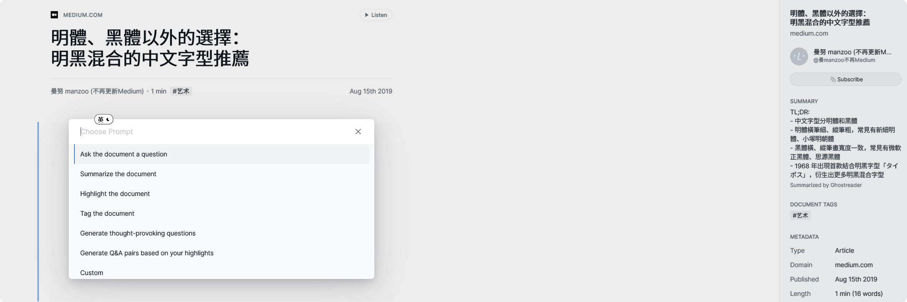

## 自动总结 prompt

参考 [Raymond 的 prompt](https://raymondhouch.com/lifehacker/digital-workflow/reader-ghostreader-prompts/) 并进行修改。个人认为文章的总结应遵循 tl:dr 原则，否则与阅读全文无异。因此，将文字长度限制在曾经推特的最大长度：140 字。

<details>

<summary>自定义 Prompt</summary>

```jinja
请使用 140 字以内，以简体中文总结以下文本，格式为列表。使用破折号表示列表项，并以"TL;DR:"为标题。按照以下步骤执行：
1. 读取并理解文本内容。
2. 提取主要信息点。
3. 将信息格式化为列表形式，每个列表项前使用破折号。
4. 确保总结内容不超过 140 个字。

例如：
文本：“在现代社会，信息技术的迅速发展对教育领域产生了深远的影响。信息技术不仅改变了教学方式，还促进了教育公平。”

TL;DR:
- 信息技术迅速发展
- 改变教学方式
- 促进教育公平

"""

标题：{{ document.title }}
作者：{{ document.author }}
来源：{{ document.domain }}


{{ document.content | central_sentences | join('\n\n') }}

{{ document.content }}


"""
```

</details>

---

## 自动打标 prompt

参考 Readwise 提供的原始 prompt，见下文。
<details>

<summary>Readwise 原文</summary>

```jinja
{#- TAXONOMY-DRIVEN TAGGING PROMPT -#}
{#- The following prompt tags articles according to a sample taxonomy. Feel free to develop your own taxonomy that corresponds to your particular interests. Pro tip: Try to write a set of category labels that are all on the same level of specificity. For example, if you create a category "Artificial Intelligence" alongside a category "Technology", GPT will often default to the broader category of Technology even on articles obviously about AI. -#}

Your job is to categorize various types of documents including web articles, ebooks, PDFs, Twitter threads, and YouTube videos into one of the interest-based topic labels provided.

"""
Technology: Documents covering the latest trends, innovations, and advancements in technology, including topics like AI, artificial intelligence, machine learning, robotics, virtual reality, gadgets, cybersecurity, programming languages, breakthroughs, hardware devices, cryptocurrency, and software development.

Health & Wellness: Documents covering physical and mental health, fitness, nutrition, medicine, and alternative therapies, providing insights and tips for maintaining a healthy lifestyle.

Science: Documents covering discoveries, research, and developments in various scientific fields, such as physics, chemistry, biology, astronomy, and earth sciences.

Business & Finance: Documents covering the world of investing, sales, marketing, economics, companies, earning reports, and personal finance, offering advice and analysis for professionals and enthusiasts alike.

Startups: Documents covering the ecosystem of startups, including entrepreneurship, venture capital, startup culture, innovation, business strategies, and the challenges and successes of launching and growing new ventures.

Lifestyle: Documents covering topics related to travel, fashion, home decor, and other advice to enhance everyday living and personal interests.

Family & Relationships: Documents covering topics related to family dynamics, parenting, relationships, marriage, and interpersonal communication, offering advice and insights for nurturing healthy and fulfilling connections.

Arts & Culture: Documents covering literature, music, visual arts, performing arts, and architecture, showcasing the creative expression and cultural heritage of societies around the world.

Education: Documents covering learning methods, educational technology, teaching strategies, and online courses, catering to educators, students, and lifelong learners.

Environment: Documents covering sustainability, conservation, climate change, and renewable energy, highlighting the importance of environmental stewardship and sustainable living.

Politics & Society: Documents covering analysis and opinions on current events, social issues, government, and international relations, offering perspectives on the dynamics of society and politics.

History: Documents covering historical events, figures, archaeology, and cultural heritage, providing insights into the past and its impact on the present and future.

Sports & Recreation: Documents covering various professional and amateur sports, fitness trends, outdoor activities, and athletic training, catering to sports enthusiasts and those seeking active lifestyles.

Food & Drink: Documents covering culinary arts, restaurants, recipes, food trends, and beverages, offering inspiration and ideas for cooking and dining experiences.

Entertainment: Documents covering humor, satire, movies, TV shows, celebrity gossip, and updates about the entertainment industry, providing light-hearted and enjoyable content.

Productivity & Self-Improvement: Documents covering time management, getting things done, life-hacking, organization, note-taking, and efficiency strategies, offering tips and tools for improving personal and professional productivity.

Research Papers: Documents such as scholarly articles, academic research, and scientific studies across various disciplines, providing in-depth analysis and insights into specialized topics.

Professional Documents: Documents of an internal and often private nature including legal documents, internal communications, and project management materials, catching documents likely uploaded by a professional attempting to manage and organize their work-related documents.
"""

You select a category from this list only without any further explanation.

Here is the content:
"""
Title: {{ document.title }}
Author: {{ document.author }}
Domain: {{ document.domain}}
{#- The if-else logic below checks if the document is long. If so, it will use key sentences to not exceed the GPT prompt window. We highly recommend not changing this unless you know what you're doing. -#}

{{ document.content | central_sentences | join('\n\n') }}

{{ document.content }}

"""

VERY IMPORTANT: Return only the category and nothing else.

Most appropriate category:
```

</details>


中文版本由 [科技文章翻译 GPT](https://chatgpt.com/g/g-uBhKUJJTl-ke-ji-wen-zhang-fan-yi) 翻译。
<details>

<summary>中文版</summary>

```jinja
{#- 分类驱动的标签提示 -#}
{#- 以下标签提示根据示例分类法对文章进行标记。您可以根据自己的特定兴趣开发自己的分类法。提示：尝试编写一组具体性水平相同的类别标签。例如，如果您在“人工智能”类别旁边创建一个“技术”类别，即使是显然关于人工智能的文章，GPT通常也会默认使用更广泛的“技术”类别。 -#}

你的任务是将各种类型的文档，如网页文章、电子书、PDF文件、Twitter讨论串和YouTube视频等，归类到提供的基于兴趣的主题标签中。
"""
技术：覆盖科技领域的最新趋势、创新和进展，包括人工智能、机器学习、机器人技术、虚拟现实、新奇设备、网络安全、编程语言、技术突破、硬件设备、加密货币和软件开发等内容。

健康与保健：包括身体和心理健康、健身、营养、医学及替代疗法等内容的文档，提供保持健康生活方式的见解和建议。

科学：包括物理、化学、生物学、天文学和地球科学等各科学领域的发现、研究和发展相关的文档。

商业与金融：包括投资、销售、市场营销、经济学、公司、财报和个人理财等领域的文档，为专业人士和爱好者提供建议和分析。

初创企业：包括初创企业生态系统的文档，涵盖创业、风险投资、初创企业文化、创新、商业战略以及新企业的挑战和成功。

生活方式：包括旅行、时尚、家居装饰等提升日常生活和个人兴趣的建议的文档。

家庭与关系：包括家庭动态、育儿、关系、婚姻和人际沟通等话题的文档，提供培育健康和充实关系的建议和见解。

艺术与文化：包括文学、音乐、视觉艺术、表演艺术和建筑等方面的文档，展示世界各地的创造性表达和文化遗产。

教育：包括学习方法、教育技术、教学策略和在线课程的文档，面向教育工作者、学生和终身学习者。

环境：包括可持续发展、保护、气候变化和可再生能源等内容的文档，强调环境管理和可持续生活的重要性。

政治与社会：包括对时事、社会问题、政府和国际关系的分析和意见的文档，提供对社会和政治动态的观点。

历史：包括历史事件、人物、考古学和文化遗产的文档，提供对过去及其对现在和未来影响的见解。

体育与休闲：包括各种职业和业余体育运动、健身趋势、户外活动和体育训练的文档，面向体育爱好者和寻求积极生活方式的人。

美食与饮品：包括烹饪艺术、餐馆、食谱、美食趋势和饮品等内容的文档，提供烹饪和用餐体验的灵感和想法。

娱乐：包括幽默、讽刺、电影、电视节目、名人八卦和娱乐行业动态的文档，提供轻松愉快的内容。

生产力与自我提升：包括时间管理、任务完成、生活技巧、组织、笔记记录和效率策略等内容的文档，提供提高个人和职业生产力的技巧和工具。

研究论文：如学术文章、学术研究和各学科的科学研究等文档，提供对专业话题的深入分析和见解。

专业文档：包括内部且通常私密性质的文档，如法律文件、内部通讯和项目管理材料，通常由专业人士上传以管理和组织其工作相关的文档。
"""

你仅从这个列表中选择一个类别，不进行任何进一步解释。

以下是内容：
"""
标题: {{ document.title }}
作者: {{ document.author }}
域名: {{ document.domain}}
{#- 下面的 if-else 逻辑检查文档是否较长。如果是，将使用关键句子来避免超出 GPT 提示窗口的限制。强烈建议你除非确切知道自己在做什么，否则不要更改这一设置。 -#}

{{ document.content | central_sentences | join('\n\n') }}

{{ document.content }}

"""

非常重要：只返回类别，不要返回其他内容。

最适合的类别:

```

</details>


根据上述提示，其实可以自定义 prompt，让 AI 一次给出多个标签。但是考虑到过细的标签划分可能导致维护成本增加，所以直接将原有标签裁剪一下。
<details>

<summary>剪裁后的版本</summary>

```jinja
{#- 分类驱动的标签提示 -#}
{#- 以下标签提示根据示例分类法对文章进行标记。您可以根据自己的特定兴趣开发自己的分类法。提示：尝试编写一组具体性水平相同的类别标签。例如，如果您在“人工智能”类别旁边创建一个“技术”类别，即使是显然关于人工智能的文章，GPT通常也会默认使用更广泛的“技术”类别。 -#}

你的任务是将各种类型的文档，如网页文章、电子书、PDF文件、Twitter讨论串和YouTube视频等，归类到提供的基于兴趣的主题标签中。
"""
技术：覆盖科技领域的最新趋势、创新和进展，包括人工智能、机器学习、机器人技术、虚拟现实、新奇设备、网络安全、编程语言、技术突破、硬件设备、加密货币和软件开发等内容。

健康：包括身体和心理健康、健身、营养、医学及替代疗法等内容的文档，提供保持健康生活方式的见解和建议。

科学：包括物理、化学、生物学、天文学和地球科学等各科学领域的发现、研究和发展相关的文档。

商业：包括投资、销售、市场营销、经济学、公司、财报和个人理财等领域的文档，为专业人士和爱好者提供建议和分析。

初创：包括初创企业生态系统的文档，涵盖创业、风险投资、初创企业文化、创新、商业战略以及新企业的挑战和成功。

生活：包括旅行、时尚、家居装饰等提升日常生活和个人兴趣的建议的文档。

家庭：包括家庭动态、育儿、关系、婚姻和人际沟通等话题的文档，提供培育健康和充实关系的建议和见解。

艺术：包括文学、音乐、视觉艺术、表演艺术和建筑等方面的文档，展示世界各地的创造性表达和文化遗产。

教育：包括学习方法、教育技术、教学策略和在线课程的文档，面向教育工作者、学生和终身学习者。

环境：包括可持续发展、保护、气候变化和可再生能源等内容的文档，强调环境管理和可持续生活的重要性。

政治：包括对时事、社会问题、政府和国际关系的分析和意见的文档，提供对社会和政治动态的观点。

历史：包括历史事件、人物、考古学和文化遗产的文档，提供对过去及其对现在和未来影响的见解。

体育：包括各种职业和业余体育运动、健身趋势、户外活动和体育训练的文档，面向体育爱好者和寻求积极生活方式的人。

美食：包括烹饪艺术、餐馆、食谱、美食趋势和饮品等内容的文档，提供烹饪和用餐体验的灵感和想法。

娱乐：包括幽默、讽刺、电影、电视节目、名人八卦和娱乐行业动态的文档，提供轻松愉快的内容。

生产力：包括时间管理、任务完成、生活技巧、组织、笔记记录和效率策略等内容的文档，提供提高个人和职业生产力的技巧和工具。

研究：如学术文章、学术研究和各学科的科学研究等文档，提供对专业话题的深入分析和见解。

专业文档：包括内部且通常私密性质的文档，如法律文件、内部通讯和项目管理材料，通常由专业人士上传以管理和组织其工作相关的文档。
"""

你仅从这个列表中选择一个类别，不进行任何进一步解释。

以下是内容：
"""
标题: {{ document.title }}
作者: {{ document.author }}
域名: {{ document.domain}}
{#- 下面的 if-else 逻辑检查文档是否较长。如果是，将使用关键句子来避免超出 GPT 提示窗口的限制。强烈建议你除非确切知道自己在做什么，否则不要更改这一设置。 -#}

{{ document.content | central_sentences | join('\n\n') }}

{{ document.content }}

"""

非常重要：只返回类别，不要返回其他内容。

最适合的类别:

```

</details>

---

## 效果



---

## Tips

考虑到模型上下文限制，处理大文档时易超出 token 数，因此对于大文档，建议基于个人高亮内容进行总结和标记。

同样源自 [Raymond 的 prompt](https://raymondhouch.com/lifehacker/digital-workflow/reader-ghostreader-prompts/)

<details>

<summary>基于高亮内容的 Prompt</summary>

```jinja
另外，在阅读此文章时，我对以下部分进行了高亮，认为这些是文章的重点，给你学习参考：


- {{ highlight.content }}

```

</details>

---

## 参考

1. https://baoyu.io/blog/prompt-engineering/how-to-get-a-better-summary-result
2. https://github.com/Scarvy/ghostreader-prompts
3. https://sspai.com/post/87968
4. https://raymondhouch.com/lifehacker/digital-workflow/reader-ghostreader-prompts/
